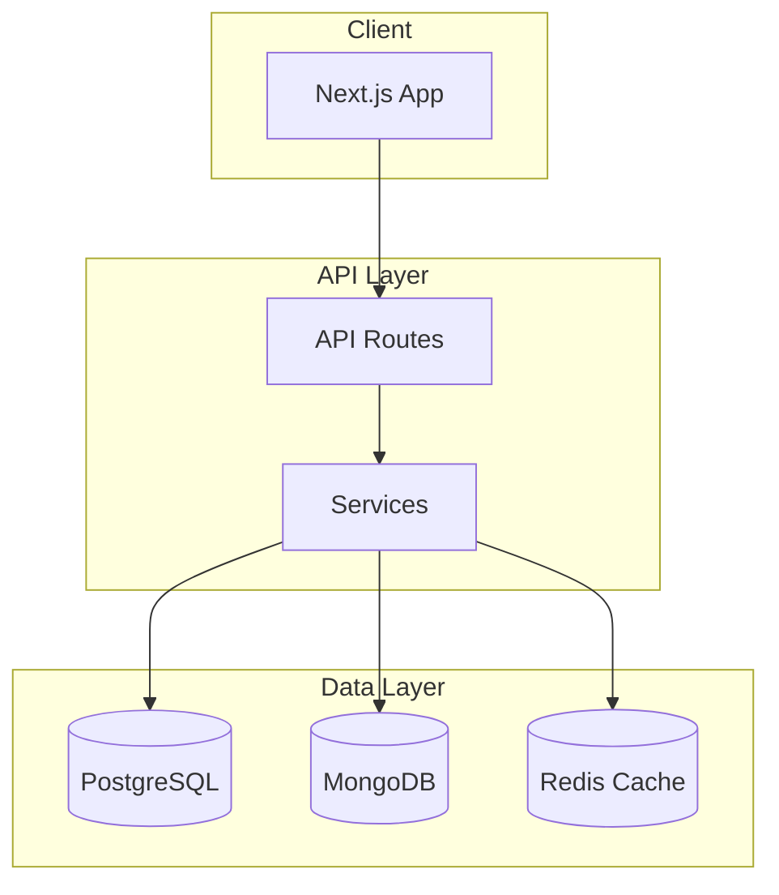

# MeritGrid: AI Engineer Guidelines (Claude/General)

These guidelines establish standardized practices for AI engineers (Claude, GPT, etc.) to ensure MeritGrid remains secure, scalable, and maintainable.

## 1. Core Architecture

### Hybrid Data Layer

- **Relational (PostgreSQL)**: Use for transactional data (Auth, Applications). Powered by **Prisma 7** with `@prisma/adapter-pg`.
- **Document (MongoDB)**: Use for varied content (Scholarships, Career Listings).
- **Caching (Redis)**: Use for session state and global rate limiting.
- **Hybrid Fetching Pattern**: All data-fetching layers must attempt to pull from the database while providing a seamless fallback to demo data. The database connection will be finalized late-stage; mock data is the primary driver for current development and testing.

### Service Layer Pattern

Every functional module must reside in `services/` and inherit from `BaseService`.

```typescript
import { BaseService } from './base.service';
export class FeatureService extends BaseService {
  async execute() {
    try {
      // Logic
    } catch (e) {
      this.handleError(e, 'FeatureService.execute');
    }
  }
}
```

## 2. Scalability Requirements (Millions of Users)

- **Database Scaling**: Implement read-replicas for PostgreSQL and sharding for MongoDB.
- **Rate Limiting**: Use the `Security.checkRateLimit()` utility for all PUBLIC and PROTECTED API routes.
- **Statelessness**: No local file storage or memory-based sessions; everything must be externalized to DB/Cache.

## 3. Security Hardening

### Authentication & Authorization
- **NextAuth.js**: Use `next-auth` for all authentication flows. Never implement custom auth.
- **RBAC Enforcement**: Strictly enforce roles (`STUDENT`, `TALENT`, `ORG`, `ADMIN`) on every protected route and API endpoint.
- **Session Security**: Use `httpOnly`, `secure`, and `sameSite: 'strict'` cookies. Set short session expiry (1 hour) with refresh tokens.
- **MFA Ready**: Design auth flows to support optional MFA (TOTP/SMS) for high-privilege accounts.

### Input Validation & Sanitization
- **Zod Schemas**: Every API mutation MUST validate input with Zod. Reject malformed requests immediately.
- **HTML Sanitization**: Use `DOMPurify` or equivalent before rendering any user-generated HTML.
- **SQL/NoSQL Injection**: Always use parameterized queries via Prisma/Mongoose. Never interpolate user input into queries.

### Data Protection
- **Encryption at Rest**: Sensitive fields (SSN, bank details) MUST be encrypted using `Security.encrypt()`.
- **Encryption in Transit**: Enforce HTTPS everywhere. Use HSTS headers with `max-age=31536000; includeSubDomains`.
- **PII Masking**: Mask PII with `Security.maskPII()` before logging. Never log passwords, tokens, or secrets.
- **Data Minimization**: Collect only necessary data. Implement retention policies and automatic purging.

### Error Handling
- **Sanitized Errors**: Never expose stack traces, DB errors, or internal paths to clients.
- **Error Codes**: Use standardized error codes from `lib/errors/codes.ts`. Return generic user-facing messages.

### API Security
- **Rate Limiting**: Apply per-user and per-IP rate limits using Redis. Return `429 Too Many Requests` on breach.
- **CORS**: Configure strict CORS policies. Only allow known frontend origins.
- **CSRF Protection**: Use anti-CSRF tokens for all state-changing POST/PUT/DELETE requests.
- **Content Security Policy**: Implement strict CSP headers to prevent XSS and injection attacks.

### Secrets Management
- **Environment Variables**: Store all secrets in `.env` (never commit). Use Vercel/AWS Secrets Manager in production.
- **Key Rotation**: Design systems to support credential rotation without service interruption.
- **Audit Logging**: Log all access to sensitive endpoints with user ID, timestamp, IP, and action. Store logs securely.

## 4. UI/UX Standards (Premium Tier)

### Design Philosophy

- **Modern & Professional**: Design must feel contemporary and premium, matching global corporate standards like **Stripe**, **Linear**, **Vercel**, and **Notion**. These are the gold standard for SaaS UI/UX.
- **Avoid AI Design Bias**: Do NOT use typical AI-generated color schemes (overly saturated purples, neon gradients, generic blue-purple combos). Aim for refined, intentional palettes that feel human-curated.
- **Global Token System**: ALL styling MUST use the established design tokens in `styles/tokens/`. Never hardcode colors, spacing, or typography values. This ensures consistency and easy theming.

### Design Tokens

- **Colors**: Use semantic tokens (`--color-primary`, `--color-surface`, `--color-text-muted`) instead of raw hex values.
- **Spacing**: Use spacing scale (`--space-1` through `--space-12`) for consistent rhythm.
- **Typography**: Use type scale tokens (`--text-xs` through `--text-4xl`) with defined line heights.
- **Shadows**: Use elevation tokens (`--shadow-sm`, `--shadow-md`, `--shadow-lg`) for depth.
- **Borders**: Use radius tokens (`--radius-sm`, `--radius-md`, `--radius-full`) for consistency.

### Visual Standards

- **Color Palette**: Neutral-first with strategic accent colors. Avoid oversaturation. Dark mode must be first-class, not an afterthought.
- **Typography**: Clean, readable fonts (Inter, SF Pro, or system fonts). Strong hierarchy with clear contrast.
- **Whitespace**: Generous spacing. Don't crowd elements. Let the design breathe.
- **Iconography**: Use a consistent icon library (Lucide, Heroicons). Avoid mixing icon styles.

### Layout & Responsiveness

- **Responsive Dual-Layout**: Separate Desktop (`lg:block`) and Mobile (`lg:hidden`) views for complex pages to ensure a premium feel.
- **Grid System**: Use CSS Grid and Flexbox with consistent column/gap patterns.
- **Breakpoints**: Mobile-first with breakpoints at `sm` (640px), `md` (768px), `lg` (1024px), `xl` (1280px).

### Interactions & Motion

- **Styling**: Vanilla CSS/Tailwind (v4). Use design tokens exclusively.
- **Interactions**: Use `framer-motion` for micro-animations and smooth state transitions.
- **Feedback**: Every action should have visual feedback (hover states, loading indicators, success/error states).
- **Transitions**: Subtle, purposeful animations (150-300ms). Avoid flashy or distracting motion.

### Z-Index Management

Avoid z-index chaos by following a strict layering system:

| Layer | Z-Index | Usage |
| --- | --- | --- |
| **Base** | 0 | Default content, cards, sections |
| **Dropdown** | 10 | Dropdowns, popovers, tooltips |
| **Sticky** | 20 | Sticky headers, navigation bars |
| **Modal Backdrop** | 30 | Modal overlays, dimmed backgrounds |
| **Modal** | 40 | Modal dialogs, drawers |
| **Toast** | 50 | Notifications, snackbars |
| **Tooltip** | 60 | Tooltips that must appear above modals |

- **Never use arbitrary z-index values** (e.g., `z-index: 9999`). Use the token system.
- **Define tokens**: Create `--z-base`, `--z-dropdown`, `--z-sticky`, `--z-modal-backdrop`, `--z-modal`, `--z-toast` in `styles/tokens/`.
- **Stacking contexts**: Be mindful of `transform`, `opacity`, and `filter` creating new stacking contexts.

### Input Fields & Form Elements

- **Icon Placement**: Input icons MUST be positioned using `absolute` positioning with proper padding offset. Never let icons overlap placeholder text.
- **Padding Convention**: Left icon = `padding-left: 2.5rem`. Right icon = `padding-right: 2.5rem`. Adjust icon container width accordingly.
- **Placeholder Text**: Always test with icons present. Placeholder must start AFTER the icon with adequate spacing.
- **Focus States**: Clear, visible focus rings using `--color-focus-ring`. Never remove focus outlines without replacement.
- **Validation States**: Use semantic colors (`--color-error`, `--color-success`) with icons for error/success states.

### Icon Standards

- **Library**: Use **Lucide React** (`lucide-react`) as the primary icon library. It's consistent, well-maintained, and has excellent React support.
- **Fallback**: If Lucide doesn't have a needed icon, use **Heroicons** (`@heroicons/react`). Never mix more than 2 icon libraries.
- **Sizing**: Standardize icon sizes: `16px` (inline), `20px` (buttons), `24px` (navigation), `32px` (features).
- **Stroke Width**: Use consistent stroke width across all icons (default: 2px for Lucide).
- **Color**: Icons inherit text color by default. Use `currentColor` for flexibility.
- **Accessibility**: Always pair icons with `aria-label` or visible text for screen readers.

> [!CAUTION]
> Never ship UI that looks "template-ish" or "AI-generated." Every screen should feel intentionally designed, polished, and on-brand with premium SaaS standards.


## 5. Standardized Practices


- **Validation**: Use Zod for all type-safety checks at runtime.
- **Naming**: Use camelCase for variables/functions, PascalCase for classes/components, and UPPER_SNAKE_CASE for constants.
- **File Links**: When referring to files in responses, use full absolute paths in markdown: `[file.ts](file:///absolute/path/to/file.ts)`.
- **Build Resilience**: Database clients in `lib/db/` must handle missing environment variables gracefully during the build phase (e.g., using placeholders) to prevent `next build` failures.
- **Prisma 7 Pattern**: Initialize `PrismaClient` with an explicit adapter and pool in `lib/db/postgresql.ts`. Do not define `url` in `schema.prisma`.

## 5. Environment Mode (`NODE_ENV`)

All policies in this document target **production-level quality**. However, when `NODE_ENV=development`, the following relaxations apply:

| Policy Area | Production | Development |
|---|---|---|
| **RBAC Enforcement** | All routes strictly enforce roles via `next-auth`. | Role checks can be mocked or bypassed for testing. |
| **Encryption** | Full `Security.encrypt()` on all sensitive fields. | Encryption is optional; plaintext is acceptable. |
| **Rate Limiting** | `Security.checkRateLimit()` on all public routes. | Rate limiting can be disabled. |
| **Validation** | Zod required for all mutations. | Zod is optional for prototyping. |
| **Data Source** | Database is the single source of truth. | Demo data is expected as the primary fallback. |
| **Statelessness** | All state must be in DB/Cache. | In-memory state is acceptable for local testing. |

> [!IMPORTANT]
> When implementing features, always write the full production logic first. Then, add `if (process.env.NODE_ENV === 'development')` blocks for relaxed behavior. This ensures a smooth transition to production with minimal refactoring.

## 6. Code Quality & Collaboration

To support a maintainable, scalable codebase that enables multiple developers to work in parallel:

- **Documentation**: Every exported function, class, and type MUST have JSDoc/TSDoc comments. Explain the "why," not just the "what."
- **Modularity**: Design features as isolated, self-contained units. Aim for single-responsibility files under 300 lines. This enables parallel development without merge conflicts.
- **Clear Contracts**: Define explicit TypeScript interfaces in `types/` for all data shapes passed between modules. This decouples components and clarifies API boundaries.
- **Feature-Based Structure**: Organize directories by feature (`components/auth/`, `services/careers/`) rather than by type. Keep related files together.
- **Readable Code**: Choose clarity over brevity. Use descriptive names, avoid deep nesting, and add inline comments for non-obvious logic.
- **Verified Dependencies**: Only install **latest, stable, and verified** npm packages. Do not use outdated, deprecated, or unmaintained packages. Always verify a package's npm stats and last publish date before installation.
- **Priority Hierarchy**: For every feature, prioritize **stability and reliability first**, followed by **speed** as a secondary goal. Performance optimizations are still important but should never compromise stability.
- **Anti-Hallucination**: Never invent APIs, library methods, or configuration options that don't exist. When uncertain about a package's interface, consult official documentation or search the existing codebase first. If still unsure, ask for clarification. Always admit uncertainty instead of fabricating answers.
- **Minimal Patch First**: When fixing bugs or errors, prefer the **smallest possible fix** that resolves the issue. Do NOT refactor surrounding code unless explicitly requested. If a refactor seems beneficial, ask for approval before proceeding. Large-scale changes introduce regression risk.

## 7. Git & Branching Strategy

- **Branch Naming**: Use prefixes: `feature/`, `bugfix/`, `hotfix/`, `chore/`. Example: `feature/auth-flow`.
- **Commit Messages**: Follow Conventional Commits: `feat:`, `fix:`, `docs:`, `refactor:`, `test:`, `chore:`.
- **Pull Requests**: All PRs MUST pass `npm run build` and lint checks before merge. Require at least one review for `main`.
- **Protected Branches**: `main` and `staging` are protected. Direct pushes are forbidden.

## 8. Testing Standards

- **Unit Tests**: All utility functions and services must have unit tests. Target **80% coverage** for critical paths.
- **Integration Tests**: Test DB-connected features with in-memory or containerized test databases.
- **E2E Tests**: Use Playwright for critical user journeys (auth, applications, dashboards).
- **File Convention**: Tests live alongside source files: `FeatureService.ts` → `FeatureService.test.ts`.

## 9. Error Handling & Logging

- **Error Codes**: Define standardized error codes in `lib/errors/codes.ts`. Never return raw error messages to clients.
- **Structured Logging**: Use JSON format with `level`, `message`, `context`, `timestamp`. Integrate with Sentry for production.
- **Log Levels**: `error` (failures), `warn` (recoverable issues), `info` (key events), `debug` (dev-only).

## 10. API Design

- **Response Envelope**: All API responses use `{ success: boolean, data?: T, error?: { code, message } }`.
- **Pagination**: Use cursor-based pagination for large datasets. Return `{ items, nextCursor, hasMore }`.
- **Versioning**: Use header-based versioning (`Accept: application/vnd.meritgrid.v1+json`) if breaking changes are needed.
- **Rate Limiting**: Apply per-user and per-IP rate limits using Redis. Return `429` with `Retry-After` header.

## 11. State Management

- **Server State**: Use **React Query** (TanStack Query) for all data fetching. Define query keys in `lib/queryKeys.ts`.
- **Client State**: Use **Zustand** for global UI state (modals, toasts). Avoid prop drilling.
- **Form State**: Use **React Hook Form** with Zod resolvers for all forms.

## 12. Accessibility (a11y)

- **WCAG 2.1 AA**: Target Level AA compliance for all user-facing pages.
- **Keyboard Navigation**: All interactive elements must be keyboard-accessible.
- **ARIA**: Use semantic HTML first. Add ARIA only when necessary.
- **Focus Management**: Trap focus in modals. Restore focus on close.

## 13. Performance Budgets

- **Bundle Size**: Main JS bundle must stay under **250KB gzipped**.
- **Core Web Vitals**: LCP < 2.5s, FID < 100ms, CLS < 0.1.
- **Images**: Use `next/image` with WebP/AVIF. Lazy-load below-the-fold images.
- **Code Splitting**: Use `next/dynamic` for heavy components (charts, editors).

## 14. Deployment & Infrastructure

### Vercel (Primary)

- **Edge Functions**: Use for low-latency routes (auth callbacks, redirects).
- **Serverless Functions**: Default for API routes. Keep cold start under 1s.
- **Environment Variables**: Set via Vercel dashboard. Use `NEXT_PUBLIC_` prefix for client-side vars.
- **Preview Deployments**: Every PR gets a preview URL for testing.

### AWS (Production Scale)

- **Compute**: Use **AWS Amplify** or **ECS Fargate** for containerized Next.js.
- **Database**: **RDS PostgreSQL** (Multi-AZ) + **DocumentDB** (MongoDB-compatible).
- **Caching**: **ElastiCache Redis** for sessions and rate limiting.
- **CDN**: **CloudFront** for static assets and edge caching.
- **Secrets**: Use **AWS Secrets Manager** for all credentials. Never hardcode.

### Database Migrations

- **Prisma Migrate**: Use `prisma migrate dev` locally, `prisma migrate deploy` in CI/CD.
- **Zero-Downtime**: Always write backward-compatible migrations. Avoid destructive changes.

### Feature Flags

- Use environment-based flags or a service like **LaunchDarkly** for gradual rollouts.
- Pattern: `if (process.env.FEATURE_NEW_DASHBOARD === 'true') { ... }`

## 15. CI/CD Pipeline

### GitHub Actions (Recommended)

Every push and PR must trigger the following workflow stages:

1. **Lint & Type Check**
   - Run `npm run lint` and `tsc --noEmit`.
   - Fail fast on any errors.

2. **Unit & Integration Tests**
   - Run `npm run test` with coverage reports.
   - Fail if coverage drops below **80%** on critical paths.

3. **Build Verification**
   - Run `npm run build` to ensure production builds succeed.
   - Cache `node_modules` and `.next` for faster runs.

4. **E2E Tests (on PRs to `main`)**
   - Run Playwright tests against preview deployment.
   - Use Vercel preview URLs or a staging environment.

5. **Security Scan**
   - Run `npm audit` or integrate **Snyk/Dependabot** for vulnerability detection.
   - Block merge if critical vulnerabilities are found.

### Deployment Triggers

| Branch | Action |
| --- | --- |
| `main` | Auto-deploy to **Production** (Vercel/AWS) |
| `staging` | Auto-deploy to **Staging** environment |
| `feature/*` | Deploy to **Preview** URL for testing |

### Pipeline Requirements

- **Secrets Management**: Store all secrets in GitHub Secrets or Vercel environment variables. Never commit `.env` files.
- **Caching**: Cache `node_modules`, `.next/cache`, and Playwright browsers for 2-3x faster builds.
- **Concurrency**: Cancel in-progress runs on newer pushes to the same branch.
- **Notifications**: Send Slack/Discord alerts on failed builds to `main` or `staging`.

### Example GitHub Actions Workflow

```yaml
name: CI/CD Pipeline
on:
  push:
    branches: [main, staging]
  pull_request:
    branches: [main]

jobs:
  lint-and-test:
    runs-on: ubuntu-latest
    steps:
      - uses: actions/checkout@v4
      - uses: actions/setup-node@v4
        with:
          node-version: '20'
          cache: 'npm'
      - run: npm ci
      - run: npm run lint
      - run: npm run test -- --coverage
      - run: npm run build

  e2e:
    needs: lint-and-test
    runs-on: ubuntu-latest
    steps:
      - uses: actions/checkout@v4
      - uses: actions/setup-node@v4
        with:
          node-version: '20'
          cache: 'npm'
      - run: npm ci
      - run: npx playwright install --with-deps
      - run: npm run test:e2e
```

## 16. Internationalization (i18n)

- **Primary Language**: English (en-US) is the default and must be fully supported first.
- **Secondary Language**: Urdu (ur-PK) support will be added in a later development phase.
- **Framework**: Use **next-intl** or **react-i18next** for translation management.
- **Translation Files**: Store in `locales/{lang}/` with JSON format. Keep keys organized by feature.
- **RTL Support**: Urdu requires right-to-left (RTL) layout. Use CSS logical properties (`margin-inline-start`, `padding-inline-end`) instead of `left`/`right`.
- **Date/Currency**: Use `Intl.DateTimeFormat` and `Intl.NumberFormat` for locale-aware formatting.

> [!NOTE]
> Build all UI components with i18n in mind from the start. Use translation keys instead of hardcoded strings, even if only English is implemented initially.

## 17. Monitoring & Observability

### Application Performance Monitoring (APM)

- **Sentry**: Primary error tracking and performance monitoring. Capture all unhandled exceptions.
- **Vercel Analytics**: Use for Core Web Vitals and real-user metrics on Vercel deployments.
- **AWS CloudWatch**: Use for infrastructure metrics, logs, and alarms on AWS deployments.

### Logging Strategy

- **Structured Logs**: JSON format with `level`, `message`, `context`, `userId`, `requestId`, `timestamp`.
- **Log Aggregation**: Use **CloudWatch Logs** (AWS) or **Vercel Logs** for centralized log storage.
- **Retention**: Keep production logs for 30 days minimum. Archive critical logs to S3.

### Health Checks

- **Endpoint**: Implement `/api/health` returning `{ status: 'ok', db: 'connected', cache: 'connected' }`.
- **Uptime Monitoring**: Use **UptimeRobot** (free) or **AWS Route 53 Health Checks** for external monitoring.
- **Alerting**: Configure alerts for >1% error rate, response time >2s, or health check failures.

## 18. Disaster Recovery

### Backup Strategy

- **PostgreSQL (RDS)**: Enable automated daily snapshots with 7-day retention. Enable Multi-AZ for failover.
- **MongoDB (DocumentDB)**: Enable continuous backups with point-in-time recovery (PITR).
- **Redis (ElastiCache)**: Enable daily snapshots. Redis data is ephemeral; design for cache-miss scenarios.
- **User Uploads**: Store in **S3** with versioning enabled. Enable cross-region replication for critical data.

### Recovery Procedures

- **RTO (Recovery Time Objective)**: Target < 1 hour for full service restoration.
- **RPO (Recovery Point Objective)**: Target < 24 hours of data loss maximum (daily backups).
- **Runbook**: Document step-by-step recovery procedures in `docs/disaster-recovery.md`.

### Failover

- **Database**: Use RDS Multi-AZ for automatic failover. DocumentDB supports replica promotion.
- **DNS**: Use Route 53 with health-check-based failover to secondary region if needed.

## 19. Incident Response

### Severity Levels

| Level | Description | Response Time | Example |
| --- | --- | --- | --- |
| **P1 - Critical** | Service down, data loss | < 15 min | DB unreachable, auth broken |
| **P2 - High** | Major feature broken | < 1 hour | Payments failing, search down |
| **P3 - Medium** | Minor feature degraded | < 4 hours | Slow dashboard, UI glitches |
| **P4 - Low** | Cosmetic issues | Next sprint | Typos, minor styling |

### On-Call Procedures

- **Alerting**: Sentry/CloudWatch triggers Slack/Discord alerts. Escalate to phone for P1/P2.
- **Acknowledgment**: On-call engineer must acknowledge within response time.
- **Communication**: Post status updates to a `#incidents` channel every 30 minutes during active incidents.
- **Post-Mortem**: Required for all P1/P2 incidents within 48 hours. Document in `docs/incidents/`.

### Rollback Strategy

- **Vercel**: Use instant rollback to previous deployment via dashboard or CLI.
- **AWS**: Use blue-green deployments. Keep previous task definition for instant rollback.
- **Database**: Use Prisma's migration history to roll back schema changes if needed.

## 20. API Documentation

### Standards

- **OpenAPI 3.0**: Document all public APIs using OpenAPI/Swagger specification.
- **Location**: Store spec in `docs/openapi.yaml`. Generate types from spec when possible.
- **Tooling**: Use **Swagger UI** or **Redoc** for interactive API docs at `/api/docs`.

### Documentation Requirements

- **Endpoints**: Document all request/response schemas, status codes, and error formats.
- **Authentication**: Clearly document auth requirements (Bearer token, API key, etc.).
- **Examples**: Provide request/response examples for each endpoint.
- **Versioning**: Document breaking changes and deprecation timelines.

### Cost-Effective Approach

- **Swagger UI**: Free, self-hosted, integrates with Next.js API routes.
- **Postman Collections**: Export collections for team collaboration and testing.
- **README**: Maintain a `docs/API.md` with quick-start examples for developers.

## 21. Architecture Diagrams

Maintain visual diagrams in `docs/` for easy reference and onboarding. Use **Mermaid** for version-controlled, text-based diagrams.

### Required Diagrams

| Diagram | File | Purpose |
| --- | --- | --- |
| **System Architecture** | `docs/architecture.md` | High-level overview of services, databases, and external integrations |
| **Data Flow** | `docs/data-flow.md` | How data moves between client, API, DB, and cache |
| **Component Hierarchy** | `docs/components.md` | React component tree and shared component relationships |
| **Database Schema** | `docs/db-schema.md` | Entity relationships (ERD) for PostgreSQL and MongoDB collections |
| **Auth Flow** | `docs/auth-flow.md` | Login, registration, session management, and RBAC flow |

### Mermaid Example



### Guidelines

- **Keep Updated**: Update diagrams when architecture changes. Include diagram updates in PRs.
- **Use Mermaid**: Store diagrams as `.md` files with Mermaid code blocks for version control.
- **Link in README**: Reference key diagrams from `README.md` and `CONTRIBUTING.md`.
- **Granularity**: Create separate diagrams for complex features (e.g., `docs/scholarship-flow.md`).
