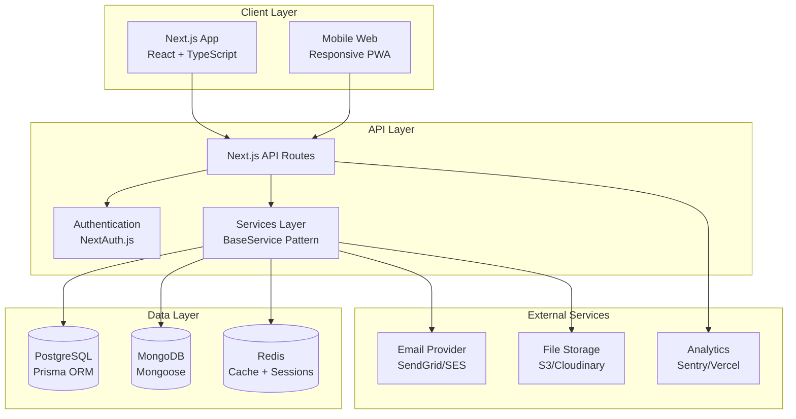

# MeritGrid System Architecture

High-level overview of the MeritGrid platform architecture.

## System Overview

## Component Responsibilities

| Layer | Component | Purpose |
| --- | --- | --- |
| Client | Next.js App | SSR/SSG pages, React components |
| API | API Routes | HTTP endpoints, request validation |
| API | Services | Business logic, data orchestration |
| API | NextAuth.js | Authentication, session management |
| Data | PostgreSQL | Users, roles, applications (relational) |
| Data | MongoDB | Scholarships, careers (document) |
| Data | Redis | Session cache, rate limiting |

## Key Design Decisions

1. **Hybrid Database**: PostgreSQL for ACID transactions, MongoDB for flexible schemas
2. **Service Layer Pattern**: All business logic in `services/` extending `BaseService`
3. **Demo Data Fallback**: Database calls gracefully fall back to mock data during development
4. **Edge-Ready**: Designed for Vercel Edge Functions and AWS deployment
