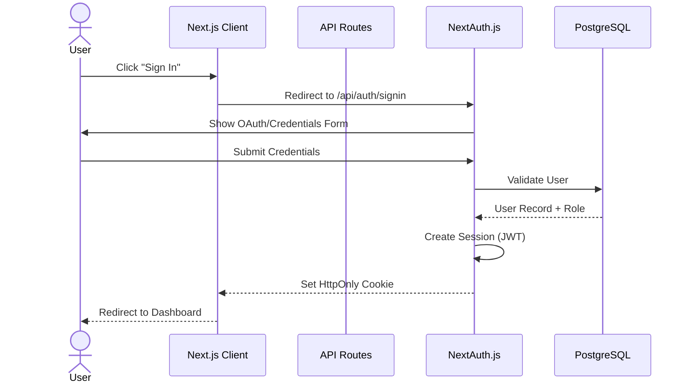
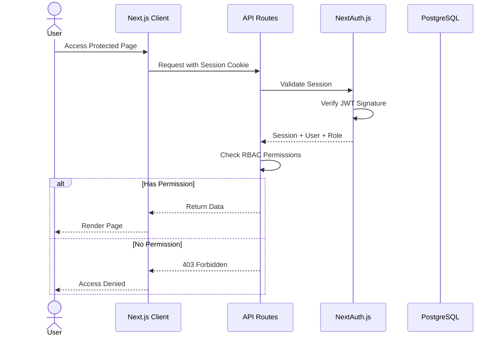
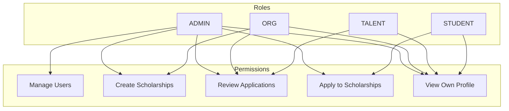

# MeritGrid Authentication Flow

Authentication and authorization flow using NextAuth.js with RBAC.

## Login Flow

## Session Validation

## Role-Based Access Control (RBAC)

## Roles & Permissions Matrix

| Permission | ADMIN | ORG | TALENT | STUDENT |
| --- | --- | --- | --- | --- |
| Manage Users | ✅ | ❌ | ❌ | ❌ |
| Create Scholarships | ✅ | ✅ | ❌ | ❌ |
| Review Applications | ✅ | ✅ | ✅ | ❌ |
| Apply to Scholarships | ✅ | ❌ | ❌ | ✅ |
| View Own Profile | ✅ | ✅ | ✅ | ✅ |

## Session Configuration

- **Cookie**: `HttpOnly`, `Secure`, `SameSite: strict`
- **Expiry**: 1 hour (with refresh token rotation)
- **Storage**: JWT in cookie, session metadata in Redis
