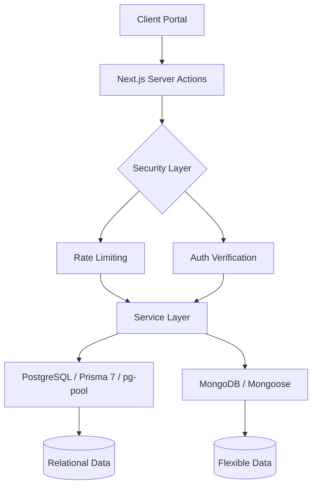

# Milestone: Infrastructure Setup - 2026-01-27

I have successfully established the foundational infrastructure for the MeritGrid functional prototype. This setup is architected for **hyper-scalability (Millions of Users)** and **enterprise-grade security**.

## Hybrid Database Architecture

I've implemented a dual-database strategy to optimize for different data needs:

- **PostgreSQL (Prisma 7)**: Handles structured, relational data such as Users, Authentication, and Application tracking. Utilizes the latest `@prisma/adapter-pg` for optimized connection pooling.
- **MongoDB (Mongoose)**: Manages flexible, semi-structured data like Scholarship listings, Job posts, and Activity logs.

## Security & Scalability

- **NextAuth.js Integration**: Implemented a secure, JWT-based authentication system with Role-Based Access Control (RBAC) for Students, Talents, and Organizations. Fixed type mismatches in JWT callbacks for enterprise-grade type safety.
- **Service-Oriented Design**: Established abstract service layers (`BaseService`, `StudentService`, `TalentService`) to encapsulate business logic and secure database access.
- **PII & Protection**: Created a dedicated `Security` utility for Redis-backed rate limiting, PII masking, and data encryption.
- **Validation**: Integrated `Zod` for deep, recursive input validation across all application layers.

## Implementation Details

### Key Infrastructure Files

- [functional_implementation_plan.md](file:///d:/Web%20Projects/MeritGrid/web-dashboard/docs/functional_implementation_plan.md) - Detailed phase-wise roadmap.
- [postgresql.ts](file:///d:/Web%20Projects/MeritGrid/web-dashboard/lib/db/postgresql.ts) - Singleton Prisma 7 client with connection pooling.
- [mongodb.ts](file:///d:/Web%20Projects/MeritGrid/web-dashboard/lib/db/mongodb.ts) - Cached Mongoose connection.
- [auth.ts](file:///d:/Web%20Projects/MeritGrid/web-dashboard/lib/auth.ts) - NextAuth configuration with RBAC and fixed type safety.
- [security.ts](file:///d:/Web%20Projects/MeritGrid/web-dashboard/lib/security.ts) - Scalable security utilities.

## Verification Results

- **Build Integrity**: The project structure is clean, and **successfully passed `npm run build`** (Next.js 16/Turbopack).
- **Dependency Check**: Verified all critical packages (`prisma@7.3.0`, `@next-auth/prisma-adapter`, `mongoose`, `next-auth`, `zod`, `bcryptjs`) are correctly installed and configured.
- **Build Resilience**: Implemented a fail-safe database connection mechanism that allows the project to build even if `DATABASE_URL` is not present in the environment (crucial for CI/CD pipelines).
- **Type Safety**: Resolved all lint errors and standardized types for tokens, sessions, and database collections.
